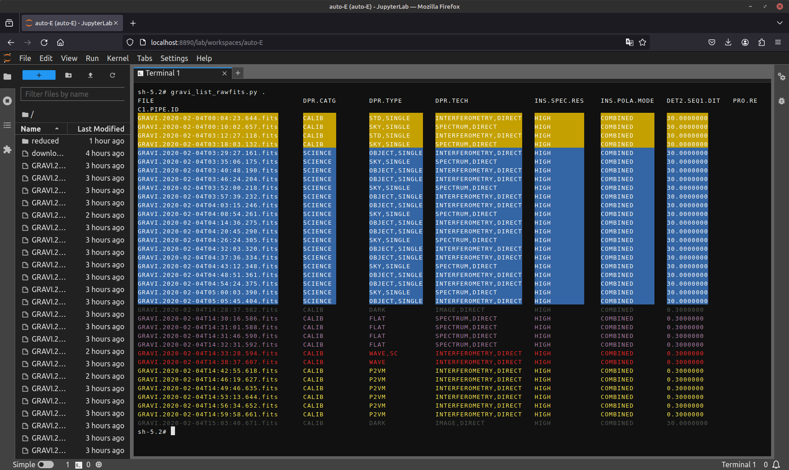

# Running the [ESO GRAVITY pipeline](https://www.eso.org/sci/software/pipelines/gravity/) and [GRAVITY's Python tools](https://version-lesia.obspm.fr:/repos/DRS_gravity/python_tools) or [esoreflex](https://www.eso.org/sci/software/esoreflex/) in containers

## [Apptainer](https://apptainer.org)

Although Docker is very popular for containerisation, it is optimised for micro-services running on host requiring the user to have some kind of root access. Apptainer is optimised for scientific computing and offer practical containers for scientifc computation, especially on shared systems. 

A good case for Apptainer is made in the [Apptainer User Guide](https://apptainer.org/docs/user/latest/introduction.html).

### Build the images: gravity-1.7.0 and python tools
To change the version of the pipeline, you can edit [gravipipe.def](./gravipipe.def) and change the pipeline version (make sure you also check you are using a supported version of Fedora!). Then build the container image:
```
$ apptainer build gravipipe.sif gravipipe.def
```

You then run the `.sif` image (in the directory where you GRAVITY FITS files are):
```
$ apptainer shell gravipipe.sif
```

You get an environment with the pipeline and python tools installed (as well as a custom [colorised](./gravi_list_rawfits.py) [dfits/fitsort](https://github.com/granttremblay/eso_fits_tools)):
```
Apptainer> gravi_list_rawfits.py
Apptainer> run_gravi_reduce.py --vis=TRUE --tf=TRUE --viscal=TRUE \
--gravity_vis.flat-flux=TRUE --gravity_vis.vis-correction-sc=FORCE \
--gravity_vis.p2vmreduced-file=FALSE --gravity_vis.astro-file=FALSE \
--gravity_vis.reduce-acq-cam=FALSE \
--commoncalib-dir=/usr/share/esopipes/datastatic/gravity-1.7.0/ 
```

### Build the images: gravity-1.6.6 and ESO Reflex

You can also build the image with the pipeline and esoreflex using [gravipipeReflex.def](./gravipipeReflex.def). Running the `.sif` image will automatically start Reflex. 

This has not been tested beyond starting Reflex: feedback is welcome!

## Docker 

The container is a Fedora 37 environment which contains all you need to reduce and analyse 
- [ESO GRAVITY pipeline](https://www.eso.org/sci/software/pipelines/gravity/) version 1.6.6. The installation is made using the dnf package manager
- python3, with numpy, scipy, matplotlib, astropy, astroquery and jupyter-lab
- the GRAVITY consortium [Python tools](https://version-lesia.obspm.fr:/repos/DRS_gravity/python_tools) to call the pipeline
- `dfits` and `fitsort` old school command lines, which sources have been [preserved by Grant Tremblay](https://github.com/granttremblay/eso_fits_tools)
- `gravi_list_rawfits.py` based on `dfits` and `fitsort` to display the content of a directory of GRAVITY ra FITS files, using color to show the nature of the files (works better with dark terminal)
- [`PMOIRED`](https://github.com/amerand/PMOIRED) to have a quicklook at the data, or do a full fledge analysis!

### Build the image:
```
$ docker build -t gravipipe:latest .
```

Run the image, sharing the directory which contain GRAVITY data to reduce (here `/home/antoine/DATA/HD58647`) on the machine running the container onto `/data` in the container:
```
$ docker run -it -p 8890:8888 -v /home/antoine/DATA/HD58647:/data --name="gravi" -d gravipipe
```
Put your raw data in the shared directory (here data). In a browser, go to [`http://localhost:8890`](http://localhost:8890) (if you run the docker locally, or to the address of the machine you are running the container on) to connect to jupyter-lab running in `/data`. From there you can reduce GRAVITY data using a terminal ad the python tools. Only the `/data` directory is shared btween the host and the container. To reduce data in another directy, you can run another instance of the container, or stop it then remove the first one to re-run with the new directory. ***Any changes outside `/data` will be lost once you remove the container!*** (e.g. if you install new software inside the container).


## colorised dfits of raw data 
in a terminal of the jupyter-lab:
```
gravi_list_rawfits.py .
```


### Reduce using python tools
in a terminal of the jupyter-lab:
```
run_gravi_reduce.py --vis=TRUE --gravity_vis.flat-flux=TRUE --gravity_vis.vis-correction-sc=FORCE --gravity_vis.p2vmreduced-file=FALSE --gravity_vis.astro-file=FALSE --commoncalib-dir=/usr/share/esopipes/datastatic/gravity-1.6.6/  --gravity_vis.reduce-acq-cam=FALSE --viscal=TRUE --tf=TRUE
```

